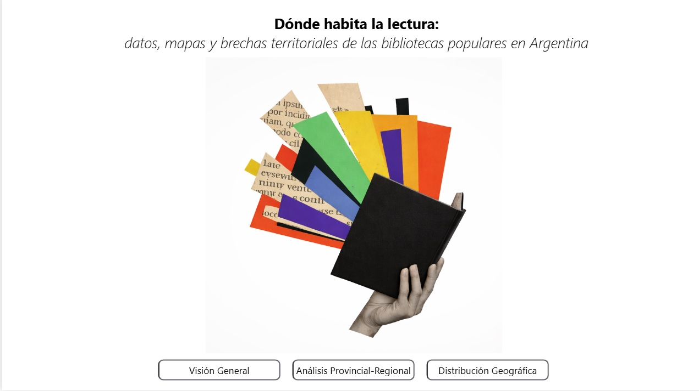
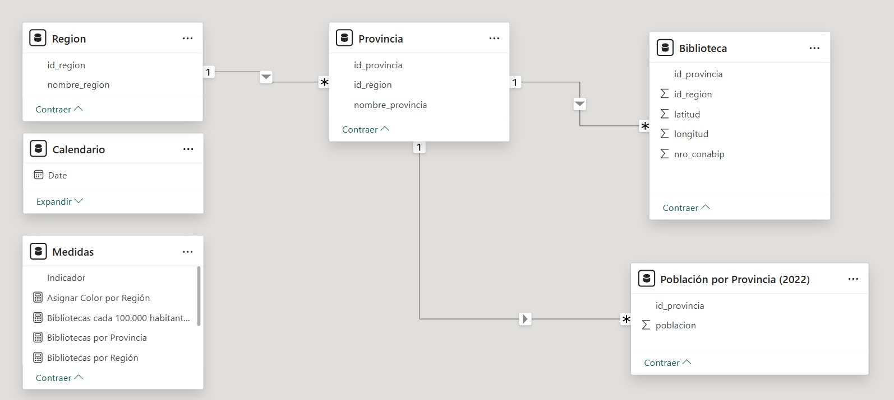
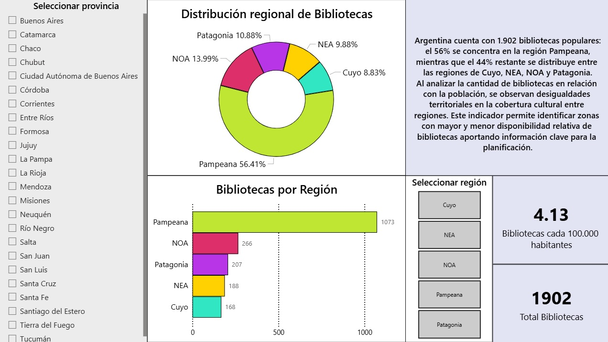
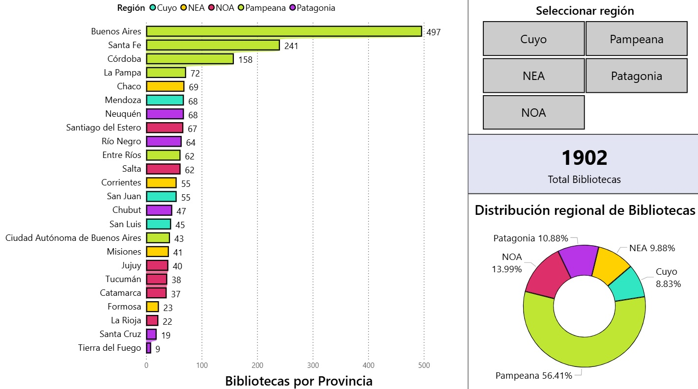
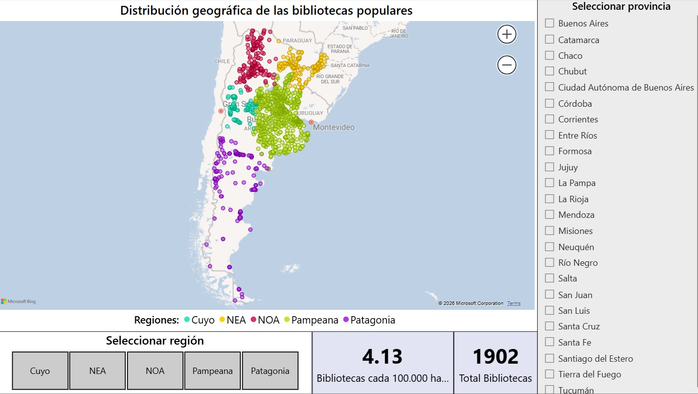

# 📊 Análisis territorial de bibliotecas populares en Argentina

## Descripción
Proyecto de análisis de datos que busca comprender la distribución de bibliotecas populares en Argentina en relación con la población, utilizando datos públicos abiertos. A través del análisis, se intenta visibilizar posibles desigualdades territoriales en el acceso a bienes culturales.

---

## 📁 Estructura del repositorio
- `/powerbi` → archivo en fortmato .pbix
- - `/docs` → documentación del proyecto
- `/images` → visualizaciones del dashboard

--

## 🛠️ Tecnologías utilizadas
- Python (Pandas)
- SQL
- Power BI
- Power Query
- DAX

---

## 🔍 Procesos realizados
- Modelado de datos conceptual y relacional
- Extracción, limpieza y transformación de datos utilizando Python y SQL
- Análisis exploratorio de datos
- Construcción de indicadores y medidas en DAX
- Visualización de datos mediante Power BI
- Generación de insights para la toma de decisiones

---

## 📈 Resultados
Se identificaron patrones y brechas territoriales en la distribución de bibliotecas, ajustando el análisis por población.

---

---

## 📊 Dashboard general

## Modelo relacional

## Visualizaciones

